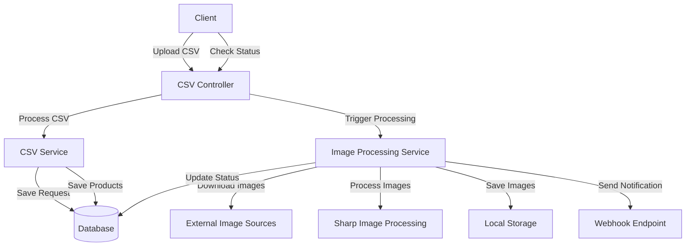

# Low-Level Design Document: CSV Image Processing System

## System Architecture

### Component Diagram


## Component Details

### 1. Controllers
#### CSV Controller (`CsvController`)
- **Role**: Entry point for HTTP requests
- **Functions**:
  - `uploadFile()`: Handles CSV file upload and initiates processing
  - `getStatus()`: Returns processing status for a request
- **Dependencies**: 
  - CsvService
  - ImageProcessingService

### 2. Services
#### CSV Service (`CsvService`)
- **Role**: Handles CSV file parsing and validation
- **Functions**:
  - `processCSV()`: Main processing function
  - `parseCSV()`: Parses CSV file content
  - `validateAndSaveProducts()`: Validates and saves product data
  - `getProcessingStatus()`: Retrieves processing status
- **Dependencies**:
  - TypeORM Repositories
  - csv-parse library

#### Image Processing Service (`ImageProcessingService`)
- **Role**: Handles image downloading and processing
- **Functions**:
  - `processImages()`: Main image processing orchestrator
  - `processImage()`: Processes individual images
  - `notifyWebhook()`: Sends webhook notifications
- **Dependencies**:
  - Sharp library
  - Axios
  - TypeORM Repositories

### 3. Entities
#### Processing Request (`ProcessingRequest`)
- **Role**: Tracks processing requests
- **Fields**:
  - `id`: UUID
  - `originalFileName`: String
  - `status`: Enum
  - `errorMessage`: String
  - `webhookUrl`: String
  - `products`: One-to-Many relation
  - Timestamps

#### Product (`Product`)
- **Role**: Stores product information
- **Fields**:
  - `id`: UUID
  - `serialNumber`: String
  - `productName`: String
  - `inputImageUrls`: String Array
  - `outputImageUrls`: String Array
  - `processingRequest`: Many-to-One relation
  - Timestamps

### 4. Data Flow
1. **CSV Upload Flow**:
   ```mermaid
   sequenceDiagram
       Client->>CsvController: Upload CSV
       CsvController->>CsvService: Process CSV
       CsvService->>Database: Save Request
       CsvService->>Database: Save Products
       CsvController->>ImageProcessingService: Trigger Processing
       CsvController->>Client: Return RequestID
   ```

2. **Image Processing Flow**:
   ```mermaid
   sequenceDiagram
       ImageProcessingService->>ExternalSource: Download Image
       ExternalSource->>ImageProcessingService: Image Data
       ImageProcessingService->>Sharp: Process Image
       Sharp->>Storage: Save Processed Image
       ImageProcessingService->>Database: Update Status
       ImageProcessingService->>Webhook: Notify Completion
   ```

## Technical Implementation Details

### 1. Database Schema
```sql
CREATE TABLE processing_requests (
    id UUID PRIMARY KEY,
    original_file_name VARCHAR(255),
    status VARCHAR(20),
    error_message TEXT,
    webhook_url TEXT,
    created_at TIMESTAMP,
    updated_at TIMESTAMP
);

CREATE TABLE products (
    id UUID PRIMARY KEY,
    serial_number VARCHAR(255),
    product_name VARCHAR(255),
    input_image_urls TEXT[],
    output_image_urls TEXT[],
    processing_request_id UUID REFERENCES processing_requests(id),
    created_at TIMESTAMP,
    updated_at TIMESTAMP
);
```

### 2. Error Handling
- CSV Validation Errors
- Image Download Failures
- Processing Errors
- Database Transaction Errors
- Webhook Notification Failures

### 3. Performance Considerations
- Asynchronous Image Processing
- Batch Database Operations
- File System Operations
- Memory Management for Image Processing
- Connection Pooling for Database

### 4. Security Considerations
- Input Validation
- File Type Validation
- URL Validation
- Error Message Sanitization
- Rate Limiting
- File Size Limits 